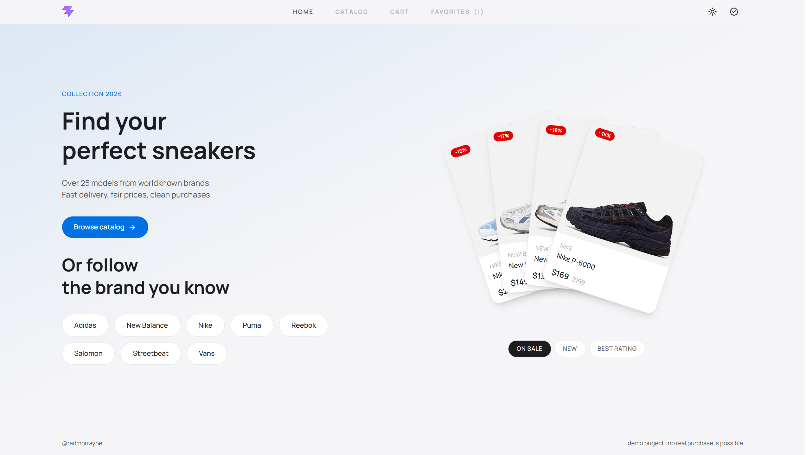

# Sneakers Store

A modern e-commerce demo built with React, TypeScript, and Supabase. Browse sneakers, filter by brand and color, add to cart, and place orders — all without real payment.



## 🔗 Live Demo

**[sneakers-store-react.vercel.app](https://sneakers-store-react.vercel.app)**

> Demo account: register with any email + password (min 6 chars). No real payment is processed.

## ✨ Features

- **Catalog** — 25 sneakers with server-side sort and filter by categories
- **Product page** — gallery per color, size selection, add to cart, favorites
- **Search** — fuzzy search by name and brand with 300ms debounce
- **Cart** — persists in localStorage, quantity controls, live totals
- **Favorites** — localStorage-based, works without login
- **Authentication** — email/password via Supabase Auth
- **Checkout** — order form, writes to database, order history in profile
- **Dark / Light / System theme** — cycles on click, persists
- **Fully responsive** — mobile drawer for filters, adaptive grids
- **Server-side pagination** — 16 items per page

## 🛠 Tech Stack

| Layer    | Choice                | Why                                                |
| -------- | --------------------- | -------------------------------------------------- |
| Frontend | React 19 + TypeScript | Type safety, modern hooks                          |
| Build    | Vite                  | Fast dev server, instant HMR                       |
| Styling  | Tailwind CSS v4       | Utility-first, CSS-first config                    |
| Routing  | React Router v7       | Standard, supports URL-as-state                    |
| State    | Zustand               | Minimal boilerplate vs Redux, persist middleware   |
| Backend  | Supabase              | Postgres + Auth + Storage in one, RLS for security |
| Icons    | Lucide React          | Consistent icon set                                |
| Deploy   | Vercel                | Zero-config, instant previews                      |

## 🏗 A few decisions worth noting

**Filters live in the URL.** Search, brand, gender, color, sort, and page number — all stored as query parameters (`?brands=nike&sort=price-asc&page=2`). This means you can share a link with filters applied, and the browser back button works as expected.

**Orders are split into two tables.** `orders` for the order itself, `order_items` for the products in it. Each item stores a snapshot of the price at the time of purchase — so if the catalog price changes later, old orders keep the price they were actually bought at.

**Each color has two identifiers.** `slug` (`clear-sky`) is unique within a product — used for the image path and as a cart key. `base_color` (`blue`) is used for filtering. This way "Clear Sky" and "Ice Peach" — both blue — appear as separate items in the cart, but under one "blue" filter option.

**Row Level Security.** Anyone can read the product catalog. Orders can only be created and read by the user who made them. This is enforced by the database, not by application code.

**Fuzzy search with trigrams.** Postgres `pg_trgm` extension + GIN indexes make `ILIKE '%nike%'` fast, even with thousands of products.

## 🚀 Getting Started

### Prerequisites

- Node.js 18+
- A Supabase project (free tier is enough)

### 1. Clone and install

```bash
git clone https://github.com/morrayne/sneakers-store-react.git
cd sneakers-store-react
npm install
```

### 2. Set up Supabase

Create a new Supabase project. In the SQL Editor, run the schema from [`docs/schema.sql`](./docs/schema.sql).

Also create a **public** storage bucket named `sneakers` for product images. Upload images following the pattern `<product-slug>/<color-slug>.jpg` (see `docs/products.csv` for the product list).

### 3. Configure environment

Copy `.env.example` to `.env.local` and fill in your Supabase credentials:

```bash
VITE_SUPABASE_URL=https://your-project.supabase.co
VITE_SUPABASE_ANON_KEY=your-anon-key
```

Find these in Supabase → Settings → API.

### 4. Run

```bash
npm run dev
```

Open [http://localhost:5173](http://localhost:5173).

## 📊 Data

The demo uses 25 real sneaker models with prices, colors, and categories. The raw data is available in [`docs/products.csv`](./docs/products.csv) — feel free to reuse it.

The database schema is in [`docs/schema.sql`](./docs/schema.sql).

## 📁 Project Structure

```
src/
├── components/       UI components grouped by feature
│   ├── auth/         Login/signup form, route guard
│   ├── cart/         Cart item rows, summary
│   ├── catalog/      Filters, search, sort, pagination
│   ├── home/         Product fan animation
│   ├── layout/       Header, footer, layout wrapper
│   ├── product/      Product card, grid, gallery, selectors
│   └── ui/           Reusable primitives (Skeleton, EmptyState)
├── hooks/            Custom hooks (useProduct, useAuth, ...)
├── lib/              Supabase client
├── pages/            Route components
├── store/            Zustand stores (cart, favorites, theme)
├── types/            Shared TypeScript types
└── utils/            Formatting, image URLs, helpers
```

## 🗺 Roadmap

Planned improvements (not necessarily soon):

- [ ] **Full redesign** — new visual language, updated typography and spacing
- [ ] **Admin panel** — manage products, prices, and stock from a UI instead of SQL
- [ ] **Expand the catalog** — add more models, categories, and brands
- [ ] **Custom backend** — potentially migrate off Supabase to a self-hosted API
- [ ] **Sync favorites to account** — currently they only live in localStorage

## 📄 License

MIT — use it however you want.
